TPK4186 - Advanced Tools for Performance Engineering Spring 2023

Assignment 1: Container Ships

Done by Christian G Kartveit

[Introduction](#introduction)

[Assumptions](#assumptions)

[Tasks](#tasks)

[Task 1](#task-1)

[Task 2](#task-2)

[Task 3](#task-3)

[Task 4](#task-4)

[Task 5](#task-5)

[Task 6](#task-6)

[Task 7](#task-7)

[Task 8](#task-8)

[Task 9](#task-9)

[Task 10](#task-10)

[Task 11](#task-11)

[Task 12](#task-12)

Introduction
------------

This project is done with previous knowledge in python from ITGK (TDT4109), and done solo. I had to make many assumptions throughout the project, and therefore some of my functions are advanced, which made the whole project a lot harder to finish.

Assumptions
-----------

1.  The ship and its containers needed to be represented in a 3D list, which can be printed out with one of the following methods below. This made the later tasks harder to do. Found out too late that this was not the task, and too late for me to change all my code.\
    If I were to start over, I would create stacks, and then use methods like pop, and push to change the order of containers.

2.  The sum of 2 small containers will not be superior to one big. The highest total weight per container is used when stacked.

3.  To remove a container at the bottom, all the containers above need to be removed, ref Task 5 explanation.

4.  The csv files mentioned in the documentation is supposed to be .tsv , but not discovered before writing the documentation. 

5.  Removing containers needs to happen in the reversed order of placement, or remove all containers at dock. To hard to implement otherwise with my approach

6.  Task 11/12 only work with specified ship setup

7.  Calculating the weight of the ship is only relevant if the ship is partly filled up.

----

Tasks
-----

### Task 1 \
This is the Container class. It has the appropriate attributes s.a length, weight, freight, id, big/small, and a position. When a container is placed on the ship, it gets a position.

### Task 2

This is more appropriate to do in the Ship class, or specify that you need a manager of containers/dock to use these methods. Therefore was this implemented in the Ship, and explained later.

### Task 3

First method, randomContainer() returns a new Container object, that is randomly created.

randomContainers() returns a set of x unique containers.

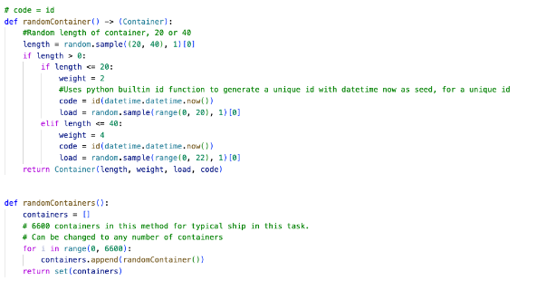

### Task 4

writeContainersToFile(containers) takes in a list, and writes the list to file, by iterating through the list, and using getters to get information needed. This is saved in a separated .csv file

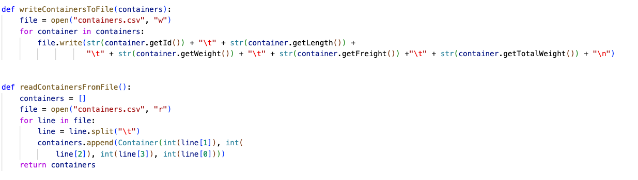

This is a screenshot of the .csv file. 

readContainersFromFile() will iterate line to line through the file, and create container objects in the returned list, containers.

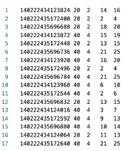

### Task 5

This is the Ship constructor. It has a length, width and height.\
It also contains a containers dictionary to more easily find container objects. 

containerBay is a 3D representation of the loading zone in the Ship. I created methods to fulfill the different restrictions, ref a 40 foot container cant be loaded on a single 20 foot. 

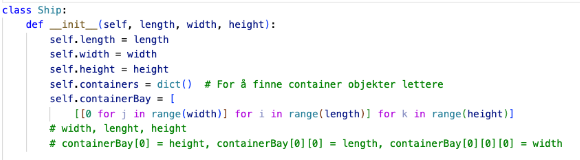

In a Ship that is 23 Long, 22 Width and 18 height, this is the representation of One layer in the ship, unloaded:

Every 0 represents a free space in the ship.
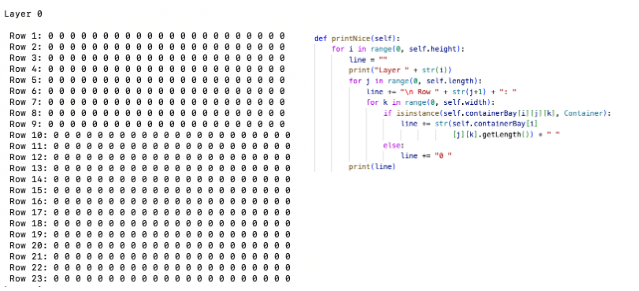

printNice is the method that prints out the ship

To find a container on the ship, we used the dictionary for fast lookup times, and returned the Container object, with the id given, else returns None if it is not in the Ship. We can also use this to get the position of the container on the Ship with the getPosition() method of the returned container.
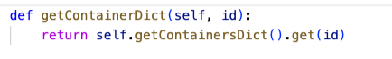

The Ship also has appropriate getters, but it will not be shown in this documentation.

The function placeFirstAvailableSpot, takes in a container, and number of cranes, and places the container on the first available spot. It will first look for a spot that fill these requirements:

-   The ship is not full, checked with the findLastSpot function

-   It has places for a 40 foot or 20 foot

-   If 40 foot, check if there are no holes below, given we are not on the first layer

-   Checks if there is place on the side, since it takes up 2 x 20 spots

-   Places the container in the 3D map, and then tells the method, that is has finished with setting Continue to False

-   It also sets the position of the container to the exact position in the ship

-   Index error appears when we try to check the spot next to a wall, so it exceeds the wall. E.g try to place a 40 foot to the far right wall, and there is not space enough for 2 * 20 slots. Then it will go back up and choose another row, or layer.

The algorithm will find the first available spot to place a container in the ship, starting from the left corner on the ship. It will maximize the amount of containers that can be placed on the ship, regarding if its 40 foot, or 20 foot.

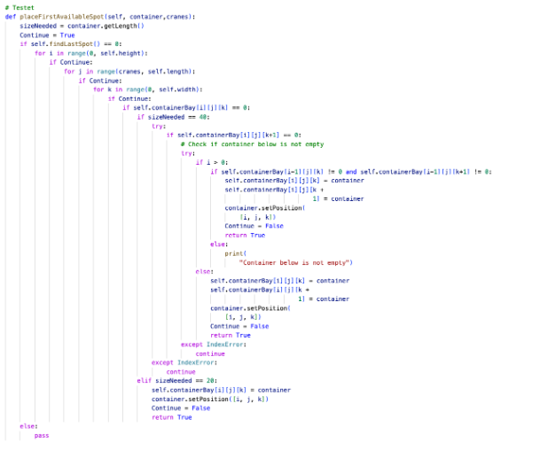

It will check the last layer and the last position, to check if it's full.

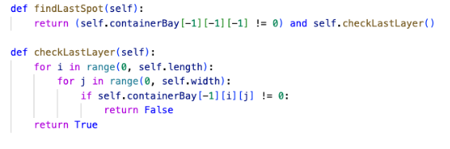

If we are able to place the container, addContainerToDict will run, and add the container to the Dictionary.

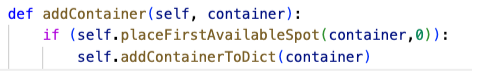

These methods will show that the methods over will work.
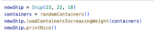

Since it places the heaviest containers low, it will mostly only contain 40 foot long containers.

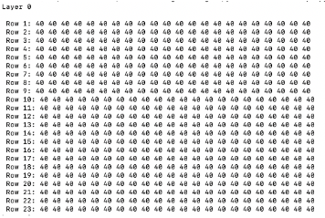

To remove a container from the ship, we need to use removeContainerFromShip, and it needs the ID to the container.

If it exist in the ship, it will remove it from the dictionary, and set the position to zero in the map

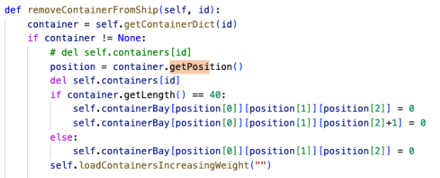

Tried to make a method to remove the containers above, but it was too complicated to do with this implementation of the Ship. The containers can still be removed in correct order, but it needs to use the method unloadContainersToSet, and use that to get the correct order to remove them.

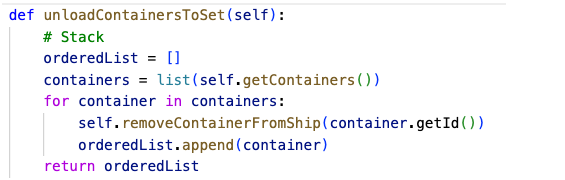

This unimplemented method does not work optimal because of the placement of containers. ( part of removeContainerFromShip method )\
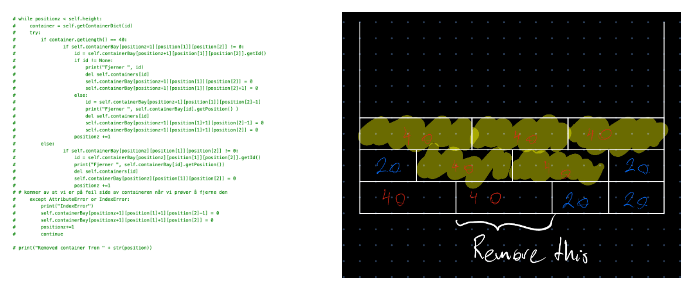

The image to the right describes the problem of unloading a container. Almost all containers above need to be removed, and not smart in real life. But since this is a simulation, it is okay. One of my assumptions is that you need to remove all containers, or remove them in reversed placed order.

### Task 6

Very familiar to the previous read/write, but it only writes containers loaded on the Ship, from the getContainers method.

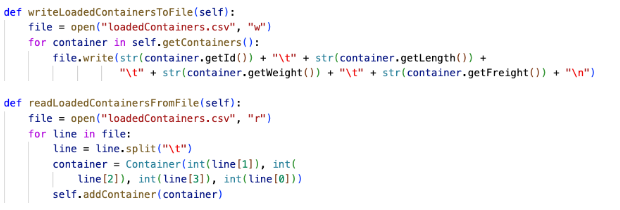

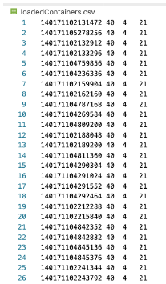

### Task 7

loadContainersFromSet will add containers in the ship, and return an orderedList by appending each container to the list.

unloadContainersToSet will return an orderedList.

They will follow all the constraints by using addContainer method, and removeContainer.

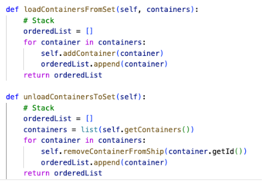

### Task 8

Loading containers from either the list or the dictionary, then sort them after weight before adding them to the list

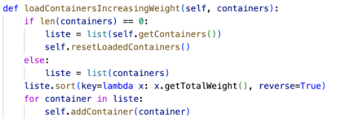

This method will do the same, but takes longer to load, and not needed when python has a built-in function to sort after weight.

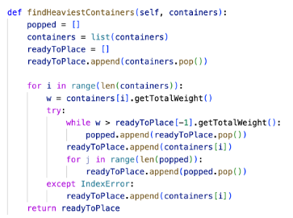

### Task 9

Total weight of containers on ship:

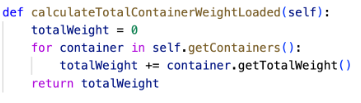

Weight starboard and portside:

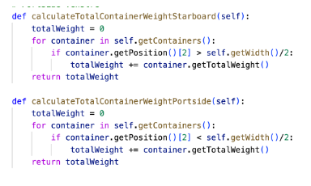

Weight front, middle and back:

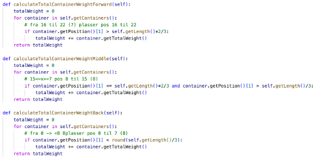

Calculate percentage weights:

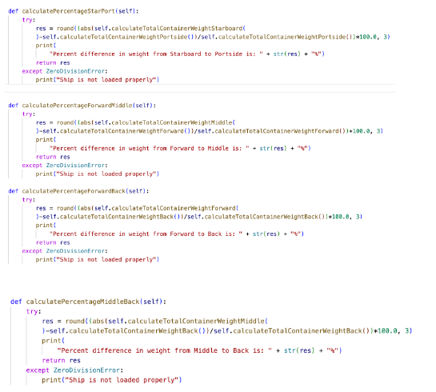

### Task 10

This function will split the list of containers in x amount, S.T the heaviest containers will be placed differently, and split. This is not an optimal solution, but hard to balance the ship with my approach.

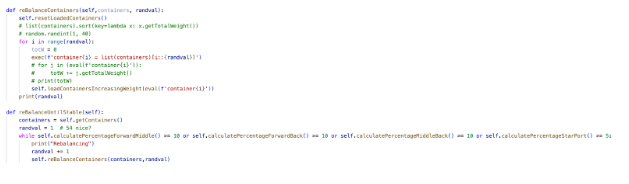

### Task 11

4 cranes only work with the current ship, else use 1 crane. The algorithm to split the sections is not perfect, therefore it will not work with all ship types.

Loading takes :
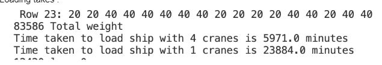

-   Do not take into consideration that you need to sort heaviest containers first.

-   Unloading takes an equal amount of time, because you can only remove all containers, or the upper ones first. (Assumption)

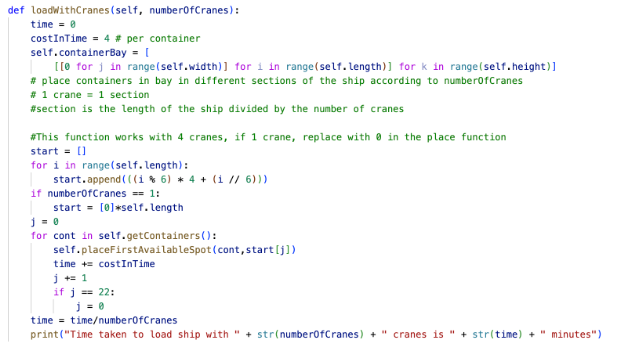

### Task 12

The ship is divided up into four sections, one crane in each section. Total time to unload is a quarter of the time with one crane