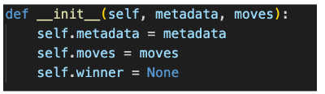

# TPK4186 - Advanced Tools for Performance Engineering Spring 2023

## Assignment 2 : ChessGames

### Done by Christian G Kartveit

## Introduction

To ensure you can run this program, you need to use the python virtual environment.
To activate use:

● Windows ``source venv/Scripts/activate``

● Mac/linux ``source venv/bin/activate``

Then run ``pip install -r requirements.txt``

This will install the required packages to run the application

##Assumptions

1. You need to run all the scripts in the requirements file to run the application
2. You need to comment out the circular imports in Database.py and
    TreeStructure.py. This is shown in the code. It will provide an error msg if not
    done correctly.

## Games

Most of the tasks from games is made done using the class ChessGame.py

It contains the metadata as dictionary, and all the moves as a list

Moves contains Move objects from Move.py:

Task 2 and 3 is done the same way as PGN files. This is implemented in Database.py and supports both versions. You can export to a file from ChessGame.py.

It is written in the same format as PGN.

Task 4 extended the class to Database.py, and it contains most of the tasks in this exercise. I used Regex search, as it was way quicker than any other method to find all the data needed to create 2600 ChessGames.

## Statistics
Task 6 is done through DocumentWriter.py, it uses python-docx and I made my own defined methods to add Headings, Paragraphs, Pictures and Tables. It will create a Word document with the selected filename. All of the figures and tasks are done in the ChessDatabase.docx file.

## Openings
This is solved with a Node class

Tree class

And a Tree Management class to process multiple trees.

Task 11 figures are provided in ChessDatabase.docx, and consists of all openings with a depth of 5. This is specified in the method, and can be decided by the user.

Task 12 figure is also provided in ChessDatabase.docx, and is a table of all openings played more than x times. In this table, it is set to N=50.