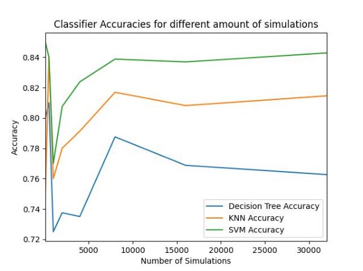
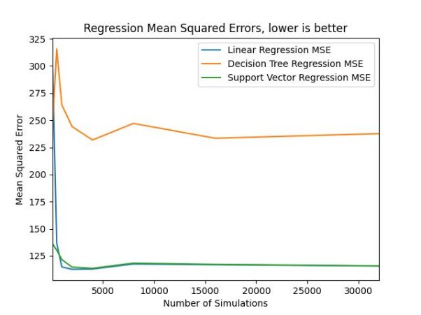

# TPK4186 - Advanced Tools for      Performance Engineering Spring 2023

## Assignment 4: Construction Project

### Done by **Christian G. Kartveit** & **Skjalg Nysaeter**

## Introduction

To ensure you can run this program, you need to use the python virtual environment. This is done by using a terminal in the delivered folder.

To create a python virtual environment, use the following command: Example: ``python -m venv /path/to/new/virtual/environment``

``Python -m venv venv``

To activate use:

- Windows ``source venv/Scripts/activate`` or.``\venv\Scripts\activate``
- Mac/linux ``source venv/bin/activate``

Then run pip install -r requirements.txt to install all packages required to run

**This will install the required packages to run the application!**

**NOTE**: We use PyGraphviz to create images of gates and the PERT Diagram. This method is commented out, since we had problems running the code on Windows machines. At the time of writing, the code works on MacOS, and the images have already been created and will be delivered together with the code.

To run the functions, run the ConstructionProject.py file. This can be done in the terminal: Run Python ConstructionProject.py , and make sure you have venv activated, and are in the correct location in the terminal.

In the main method, it contains task1to3() and task4to6() to run all the tasks from Exercise 4.

## Assumptions

- You need to run all the scripts in the requirements file to run the application
- There was an error discovered in the *Villa.xlsx* file, and corrected in the delivered version. The change was to move Task J.1 below Task J.2 and Task J.3.

## Structure

### Files

- **ConstructionProject.py:** The simulations and the assignment-tasks.
- **PERTdiagram.py:** The pert diagram.
- **Tasks.py:** The task object.
- **Printer.py:** The printer object.
- **requirements.txt:** The programs needed to run the program.
- **other:** Excel files, graph png’s, csv files.

Classes

Everything is object oriented.

- **Task:** Contains a task id, a description, predecessors, successors, different durations, a risk factor, ES, LS, EF, LF, a slack variable, and a critical path boolean.
- **PERTdiagram:** Contains a critical path, a task list, shortest-, mode-, longest-, and actual-duration, a risk factor, a list of early completion dates, and an intermediate gate.
- **Printer:** Contains an output location
- **Simulation:** Contains the amount of simulations

**Task**

Represents the component of the simulation. Calculates the actual duration by triangulating and adding risk factor.

**PERTdiagram**

Responsible for all the calculations done inside a single simulation. Also responsible for loading the data from excel and appending the task objects to a list after initiating them.

**Printer**

The printer class consists of functions that print the tasks and calculations, as well as output for the tasks 4-6.

**Simulation**

Responsible for running the and loading them into the csv files for easier storage. Here are the tasks methods 4-6 located as well.

## Functionality

**Task 1:** Handling the components of a task is done in the Task class. Then the tasks can be added to the PERTdiagram. The PERTdiagram has functions for replacing the strings with the actual task objects in predecessors, as well as adding the successors. This is done with the **connectTasks()** method.

**Task 2:** The PERTdiagram is responsible for collecting the data from the excel document. We utilize the pandas library to collect the information and assign the right values to the attributes of each task object. It's done with the **collectProjectFromExcel()** method

**Task 3:** The PERTdiagram calculates the ES, EF, LS, and LF, as well as the critical path. It does this with the **forwardPass()**, **backwardPass()** and **findCriticalPath()** methods. The **calculateDurations()** takes care of the min mode and max durations of a project.

**Task 4:** Only one PERT diagram object is created, but the risk factor and triangular duration of the tasks between each simulation is altered to create multiple simulations. The simulations are written to a csv file using the **createCSV()** method for easy access to the data.

The **Task4()** method collects the data and performs statistics on them using the **classifyProject()**, and **describe()** methods.

**Task 5:** The **Task5()** method collects a batch of data from the results in the csv file, and splits it 80/20 to training/test data. The data is split into X and Y axis data (early completion dates and projects class) and then applied to the classification methods Decision tree, k-nearest neighbors, and Support Vector Classification. Reports of the result and discussion are found in the experiments section.

**Task 6:** The **Task6()** collects and splits the data the same way as task 5, but uses Project duration instead of early completion dates. Then the data is applied to the regression methods Linear regression, decision tree classifier, and support vector regression. Reports of the results and discussion are found in the experiments section.

**Other functionalities:**

- The **createAndVisualizegraph()** method creates a node tree to display the tasks and their successors and predecessors, as well as the intermediate gate.
- The method **multipleSimulations()** are used for executing machine learning on different sizes of simulations and plotting them in the same graph for comparison.

**Node graphs:**

Underneath you can see a visualization of the node graphs. The red circle is the intermediate gate which is set manually on the preferred task with the **setIntermediateGate()**. These are the indexes of the tasks that are viable for a gate in the simulation. [1, 5, 9, 12, 13, 14, 15, 18, 23, 28, 36, 37, 45, 49, 50, 59, 60, 61]

 

## Experiments

**Task 5:** With small datasets the decision tree and k-NN methods should perform better. They are quite simple and have low computational overhead. However, decision trees are sensitive to high variance in data, and k-nn needs the k parameter to be tuned correctly to work properly.

The SVC should handle larger datasets better as it is more robust to noise and high dimension data. It does require more processing power than the other methods.

The graph below shows the accuracy of the different classification methods over different sizes of datasets. The SVC performs generally better than the other methods, so if performance is more important than costs it is the preferable method.

**Task 6:** Similar to task 5, the decision tree as well as the linear regression method are good choices for smaller datasets. They are both simple algorithms that can provide insights into the datasets. However, they are prone to overfitting as well as high variance in data.

The SVR is a better choice for large datasets as it handles high-dimensional data and non-linear relationships better. Similar to the SVC, the SVR also requires more processing power.

The graph below shows the accuracy of the different classification methods over different sizes of datasets. The SVR and the linear regression perform consistently and significantly better than the decision tree. Here linear regression may be preferable to avoid unnecessary processing costs.

**Conclusion**

The SVM classification provides the correct results in 84% of the cases with larger data sets.

The SVC and Linear Regression are both good methods, as both provide a Mean Squared Error close to 100 for larger Datasets. If we look at the min duration,which is 310, and the max duration, which is 466, we get a 156 unit gap. An average error of 10 units per simulation is therefore a reasonable result by the regression methods.
